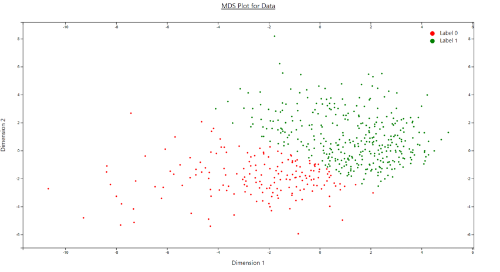
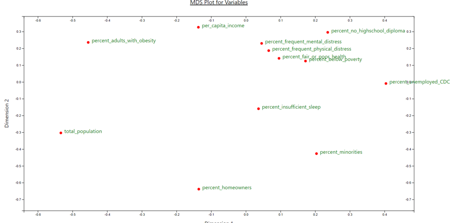
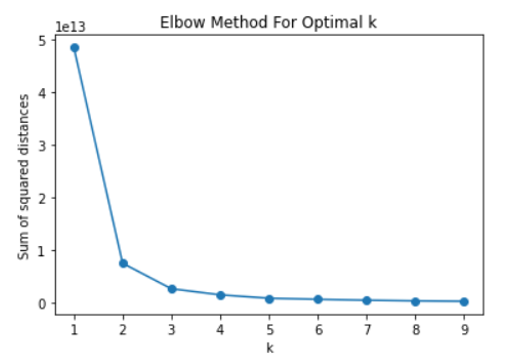
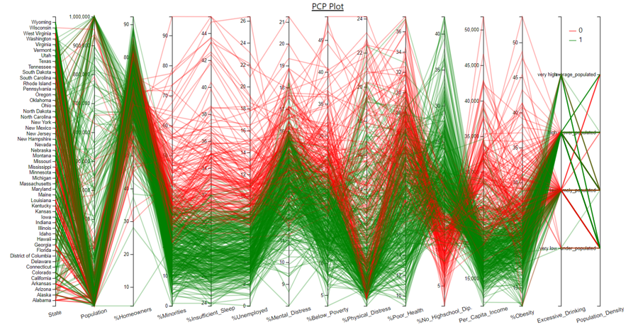
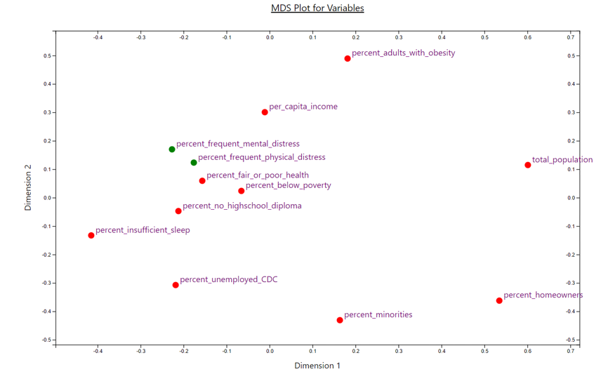
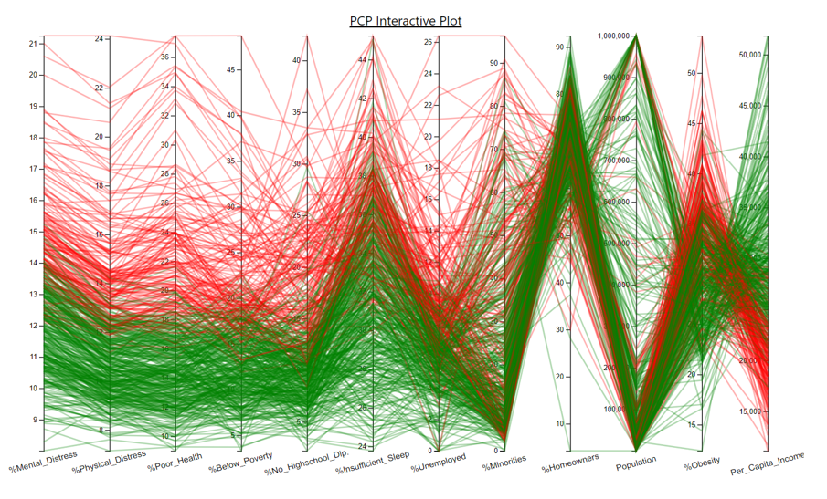
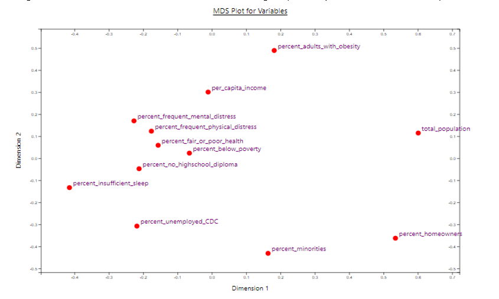
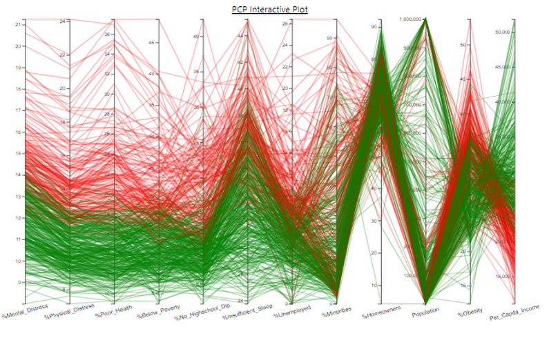
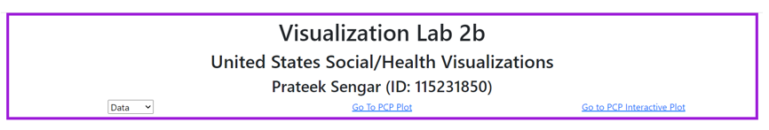

# Visualization Lab 2b
## Prateek Sengar

## [Dashboard Demo](https://youtu.be/tT0GnHcHJTs)

### Dataset
I was very intrigued by the data regarding the Social Health of the United States, hence I decided to go with it and notice some trends. The dataset had 181 columns and 3144 rows from which I chose 15 which I felt would describe the current social and health status of the United States as a whole. There was a lot of preprocessing that went into creating the final dataset. Some examples are removing the excessive columns and rows, dealing with NaN values, etc. The final dataset had 15 columns and 527 rows. Also, entries were each county and rows were selected by taking 3 of the most and least populous counties, and the remaining were average-populated counties for each state.

### Multidimensional Scaling (MDS) Plot
The MDS plot maps the observable distances from N-D into low-D (say 2D) and tries to make sure that differences between adjacent pairs of points in this condensed space are as similar as possible. Hence, closer points tend to stay close in the 2D projection. 
There are two variations of the MDS we had to implement, and they are as following:
1. **Data MDS Plot**: Plots all the data points from the N-D space to 2D space using the Euclidean Distance. The following image shows what I got for my data points. The points are clustered and colored using the K-Means clustering algorithm (more about it further). 

   

2. **Variables’ MDS Plot**: Plots the attributes using the 1 - |correlation| distance such that highly correlated variables are plotted closer. The following is my variables MDS plot. 

   

It can be seen that attributes like mental_distress, physical_distress, poor_health, etc are closer hence more correlated. However, population and insufficient_sleep are far apart hence less correlated.

### Selection of K (Clustering)
Clustering was required to color the points and the lines in the MDS plot and PCP plot respectively. For this clustering, I used the K-Means clustering algorithm. The number of clusters was selected to be 2 after studying the graph obtained by applying elbow method (picture below). 

   

As we can see that the sum of squared distances starts to plateau as k becomes 2, the number of clusters was chosen to be 2.  

### Parallel Coordinates Plot (PCP) Matrix
In the parallel coordinate plot, each attribute axes is arranged in parallel, and each row of the data table is shown as a line traversing through these axes hence a point on the line represents each attribute in a row. 
1. **Basic Parallel Coordinates Plot**: The basic version of the PCP includes all attributes (categorical and numerical). The following is my PCP plot where axes such as state, excessive_drinking, etc are the categorical variables while percent_minorities, percent_homeowners, etc are numerical attributes. 

   

2. **Interactive Parallel Coordinates Plot**: The interactive version of the PCP includes only numerical attributes. The interaction here is the rearrangement of the axes using the variables’ MDS plot. We first select the points in the MDS variables’ plot in order in which we have to arrange the axes. It is shown in the following diagram (here the mental_distress and physical_distress attributes are selected in order and hence they turned green unlike other points which are red.)  

   

   As soon as I select the last point, the PCP gets updated as follows:

   

   As it can be seen, the attributes are arranged as per selected mental_distress, physical_distress, and so on. Also, it can be seen the first a few attributes are highly correlated as they were closer in the variables’ PCP.

   Also, after the rearrangement of axes the points in the MDS goes back to red and hence they can again be selected and the axes can be reordered again (as many times as the user likes).

   

   

### Menus
The option to traverse around the different graphs is provided in the menu. There are links to each plot. For the scree plot, we have the option of limiting the plot by using a dropdown. 
**Main Menu:**

**MSD Plot Menu:**

**PCP Menu:**

**PCP Interactive Menu:**

